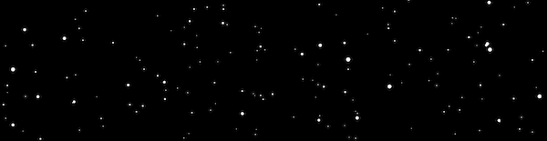

# Starfield

Create vector (SVG) or image (PNG) starfields

## Background

I love vector drawing. Some of my favorite tools are:

* [Sketch App](https://www.sketch.com)
* [Affinity Designer](https://affinity.serif.com/en-us/designer/)
* [Vectornator](https://vectornator.io)
* [Adobe Illustrator](https://www.adobe.com/products/illustrator.html)

Often I find myself drawing outer space scenes, which typically require a star field as the background. Drawing a star field in the above tools is tedious. You really need random postions and random star sizes to really get a "natural" looking star field. 

So I decided to create one programatically with Python. Using Jupyter Notebooks, I create a very simple tool that generates PNG or SVG star field files. 

The PNG image is pretty straightforward. It just adds the stars to a background and outputs the image. The SVG will place all the stars in a group named "stars". The background is also on its own layer. This is very helpful when you import the SVG into a vector image tool like SketchApp. 

## Star Distribution

**UPDATE** There is now logic in the starfield creation that prefers to create more smaller stars and less bigger stars. This more closely reflects what you would see in nature.

## Usage

Step 1 is get Jupyter Notebooks running. I recommend using [Anaconda](https://www.anaconda.com/distribution/) to install Jupyter on your system. Next clone or download this repo. Then using the supplied example create your images.

You can set height, width, padding, star radius, number of stars, star color, background color and the filename.  All values have defaults, so you can create an image with almost no fiddling.

## The Future

I have a few ideas, I would like to change in the future.

* Color the stars. Like a very little red, blue yellow
  * [What Color are Stars](https://lovethenightsky.com/what-color-are-stars/)
* Create new star shapes other than perfect circles.
* Figure out how to properly display an SVG in a Jupyter Notebook. It only shows the top 10%-15% of the image for some reason.
* I would like to get real star position data from somewhere to feed this tool, so it could make real star fields. I would need to translate the star position to a x, y coordiante. I would also probably use magnitude to determine the radius of each star.
